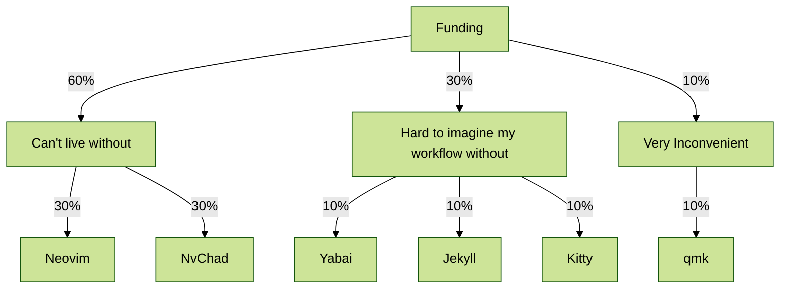

Relying on any piece of software creates a dependency and that's fine as long as
the risk is an educated choice and can be afforded. This risk goes beyond
open-source, which might be the first that comes to mind. Organizations for
their reasons can, and will, stop supporting software you or your organization
rely on and in this case, there is nothing you can do about it. On the other
hand, there is something you can do about derisking your dependency on
open-source software and that is to support it financially. The latest
[supply chain attack on xz](https://panther.com/blog/cve-2024-3094-linux-supply-chain-compromise-affecting-xz-utils-data-compression-library/)
hopefully made everyone realize how deeply everyone relies on open-source
software, while not fully grasping the implications.

After digesting what happened with xz, I thought that if I were running an
organization that relies on open-source software, I would allocate a budget to
fund it based on how critical the dependency on it would be. I don't run an
organization, but I use open-source software daily and I can't imagine my
workflows without it. I use open-source software for my blog, my keyboard, my
editor, my terminal emulator, my window manager, and my status bar. I decided to
track what I rely on the most and then think about what funding structure would
make me sleep better at night.

**I can't live without** [Neovim](https://neovim.io/), and its
[NvChad](https://nvchad.com/) distribution, period. Then, it would be **hard to
imagine my day-to-day workflow** if I had to change
[Yabai](https://github.com/koekeishiya/yabai), my window manager,
[Jekyll](https://jekyllrb.com/), that I'm using for managing my blog, and
[Kitty](https://sw.kovidgoyal.net/kitty/quickstart/), my terminal emulator.
Last, it would be **very inconvenient** if [qmk](https://qmk.fm/) stopped being
maintained, as I'm using it to manage my keyboard's firmware. It wouldn't be the
end of the world, since even without updating again my keyboard's firmware, it
would still work though.

Next, trying to map "can't live without", "hard to imagine my day-to-day
workflow" and "very inconvenient" to monthly funding amounts, the following
structure made me feel comfortable:

Some honorable mentions that will not be on my monthly sponsorship, but I will
sponsor from time to time, are core neovim plugins I'm using, like:

- [conform](https://github.com/stevearc/conform.nvim)
- [nvim-lint](https://github.com/mfussenegger/nvim-lint)
- [nvim-dap](https://github.com/mfussenegger/nvim-dap)
- [mason](https://github.com/williamboman/mason.nvim)
- [lazy](https://github.com/folke/lazy.nvim)
- [markdown-preview](https://github.com/iamcco/markdown-preview.nvim)

and [SketchyBar](https://felixkratz.github.io/SketchyBar/), that I'm using for
my status bar.
