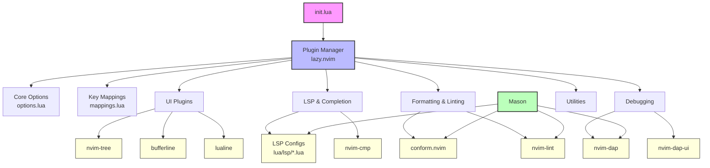

#### Table of Contents

- [So after all, why Neovim?](#so-after-all-why-neovim)
- [General Structure of a Neovim Config](#general-structure-of-a-neovim-config)
- [Overview of the main modern Neovim plugins](#overview-of-the-main-modern-neovim-plugins)
  - [Language Server Protocol (LSP) Setup](#language-server-protocol-lsp-setup)
  - [Formatting with Conform](#formatting-with-conform)
  - [Linting with nvim-lint](#linting-with-nvim-lint)
  - [Debugging with DAP](#debugging-with-dap)
  - [Mason for Tool Management](#mason-for-tool-management)
  - [AI-Powered Development with CodeCompanion](#ai-powered-development-with-codecompanion)

---

After finishing my [keyboard
build](), I experienced how
rewarding and fun it was to have your tools tailor-made specifically for your
taste and needs, and the next stop had to be my editor.
[Neovim](https://neovim.io/) was the cool kid on the block, without me realizing
back then why, but I had to give it a try.

Initially, I was lost and overwhelmed. I was watching influencers building their
configurations from scratch and starting from scratch with Neovim is just
daunting. You need to configure everything: syntax highlighting, file explorer,
status line, buffer management, and more. This could take weeks of tweaking
before you even have something usable. This has now changed, since you can start
a configuration from scratch using AI tooling, but even in this case, you need
to really know what you need, and you just don't know when you start. Then I
discovered pre-made configurations that you could customize, and I started with
[NvChad](https://nvchad.com). I fell in love with it, because it was minimal
which is my overall aesthetic and taste. Also because it was guiding you to
discover it. It had plugins that were guiding you when typing shortcuts and a
cheatsheet page with all the available commands. Then I got familiar with the
vim modes and keybindings and everything clicked! I realized how fun and
productive the otherwise mundane task of editing text files had suddenly become.
I had to get more out of it.

I started with blindly stitching Lua code from other configurations and guides
and ended up supporting all the languages I was using. To my surprise back then,
you could have all the features of an IDE, like autocompletion, formatting,
linting and even debugging. All these thanks to VSCode which pioneered the
Language Server Protocol (LSP), making it possible for any editor to leverage
the same language intelligence that powers modern IDEs.

### So after all, why Neovim?

After many months of working on my config, and eventually my vim config for
simple text editing over ssh, I started to understand why Neovim was the cool
kid on the block. Neovim is a modern fork of [Vim](https://www.vim.org/) that
brings Lua as the scripting interface for configuration, built-in LSP support,
and an extensible architecture that makes it a joy to customize. You will never
appreciate Lua, unless you write vim script. Also, when compared to traditional
IDEs, Neovim is lightweight, runs in the terminal, and can be tailored to fit
exactly how you work. The "Edit Text at the Speed of Thought" mantra, which you
can't comprehend unless you experience it.

### General Structure of a Neovim Config

If you are thinking to build your own config, here's a chart I wish I had when
starting:



The `init.lua` file is the entry point that bootstraps everything. It loads the
plugin manager, which in turn loads all plugins. Core options and key mappings
are kept separate for maintainability. LSP configurations live in their own
directory, making it easy to customize each language server independently.

### Overview of the main modern Neovim plugins

When I started my Neovim journey, the plugin ecosystem was still evolving. Every
few months, core plugins were being replaced by new ones, so I was playing cat
and mouse for a while, which sometimes was fun, other times it wasn't. Since
then, the ecosystem has stabilized for about a year, so here are the core
plugins and a sample setup.

#### Language Server Protocol (LSP) Setup

The LSP configuration is where Neovim truly shines. Instead of configuring each
server inline, with Neovim 0.11 you can keep custom configurations in separate
files under `lua/lsp/`:

```lua
-- lua/configs/lspconfig.lua
local servers = {
  "bashls",
  "clangd",
  "cssls",
  "dockerls",
  "gopls",
  "html",
  "lua_ls",
  "marksman",
  "pyright",
  "ruby_lsp",
  "taplo",
  "terraformls",
  "tflint",
  "ts_ls",
  "vimls",
  "yamlls",
}

-- Load custom configs from lua/lsp/<server>.lua
for _, server in ipairs(servers) do
  local ok, custom = pcall(require, "lsp." .. server)
  if ok then
    vim.lsp.config(server, custom)
  end
end

vim.lsp.enable(servers)
```

This approach keeps the main configuration clean while allowing for
server-specific customizations. For example, my Go LSP configuration enables
auto-importing and placeholder completion:

```lua
-- lua/lsp/gopls.lua
return {
  settings = {
    gopls = {
      completeUnimported = true,
      usePlaceholders = true,
      analyses = {
        unusedparams = true,
      },
    },
  },
}
```

#### Formatting with Conform

Automatic formatting on save is usually a non-negotiable.
[conform.nvim](https://github.com/stevearc/conform.nvim) handles this elegantly:

```lua
-- lua/configs/conform.lua
local options = {
  formatters_by_ft = {
    c = { "clang-format" },
    go = { "goimports", "gofmt" },
    javascript = { "prettier" },
    lua = { "stylua" },
    python = { "isort", "black" },
    terraform = { "terraform_fmt" },
    -- ... and more
  },
}

require("conform").setup {
  formatters_by_ft = options.formatters_by_ft,
  format_on_save = function()
    if not vim.g.format_on_save then
      return
    end
    return { lsp_format = "fallback", timeout_ms = 3000 }
  end,
}
```

The `format_on_save` toggle is controlled by a global variable, which I can
quickly toggle with `<leader>tf` when I need to save without formatting.

#### Linting with nvim-lint

While LSPs catch many issues, dedicated linters often provide deeper analysis.
[nvim-lint](https://github.com/mfussenegger/nvim-lint) runs linters on save and
when leaving insert mode:

```lua
-- lua/configs/lint.lua
local lint = require "lint"

lint.linters_by_ft = {
  go = { "golangcilint" },
  markdown = { "markdownlint" },
  python = { "pylint" },
  ruby = { "rubocop" },
  terraform = { "tflint" },
}

vim.api.nvim_create_autocmd({ "BufEnter", "BufWritePost", "InsertLeave" }, {
  group = vim.api.nvim_create_augroup("lint", { clear = true }),
  callback = function()
    lint.try_lint()
  end,
})
```

#### Debugging with DAP

Debugging directly in Neovim was a game-changer for me, since I realized you can
simply drop the need for an IDE for good. The Debug Adapter Protocol (DAP) setup
includes support for Go and Python:

```lua
-- lua/plugins/dap-go.lua
return {
  "leoluz/nvim-dap-go",
  ft = "go",
  dependencies = {
    "mfussenegger/nvim-dap",
    "rcarriga/nvim-dap-ui",
  },
  config = function(_, opts)
    require("dap-go").setup(opts)
  end,
}
```

#### Mason for Tool Management

All LSP servers, formatters, linters, and debuggers are managed through
[Mason](https://github.com/williamboman/mason.nvim). The configuration ensures
all required tools are installed automatically:

```lua
-- lua/plugins/mason.lua
opts = {
  ensure_installed = {
    "bash-language-server",
    "black",
    "clangd",
    "debugpy",
    "delve",
    "gopls",
    "prettier",
    "pylint",
    "pyright",
    -- ... and more
  },
}
```

This means a fresh installation gets all the tools it needs without manual
intervention. There is a caveat I haven't tackled yet, which is what happens
when a project depends on a tool version that is behaving differently than the
global tools that Mason has installed. I haven't run into this yet, so this
bridge will be crossed later.

#### AI-Powered Development with CodeCompanion

The latest addition to my setup is
[CodeCompanion](https://github.com/olimorris/codecompanion.nvim), which
integrates AI assistance directly into Neovim:

```lua
-- lua/plugins/codecompanion.lua
return {
  "olimorris/codecompanion.nvim",
  opts = {
    strategies = {
      chat = {
        adapter = {
          name = "anthropic",
          model = "claude-opus-4-5-20251101",
        },
        tools = {
          opts = {
            default_tools = { "full_stack_dev" },
          },
        },
      },
    },
  },
}
```

With `<leader>cc`, I can open a chat window and ask questions about my codebase,
generate code, or get explanations for complex logic, all without leaving my
editor.
