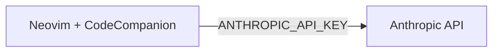
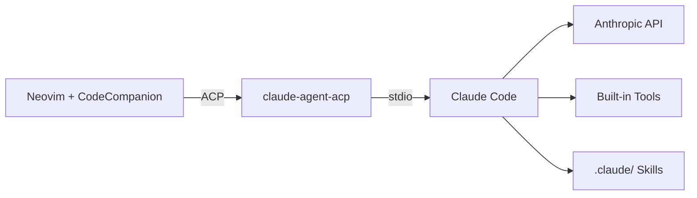

#### Table of Contents

- [The problem with a direct API adapter](#the-problem-with-a-direct-api-adapter)
- [What ACP is](#what-acp-is)
- [The switch](#the-switch)
- [What you actually get](#what-you-actually-get)

---

[A couple of months ago]() I wrote about my
Neovim configuration and how
[CodeCompanion](https://github.com/olimorris/codecompanion.nvim) brings AI
assistance into the editor. Back then, it was wired directly to the Anthropic
API — you set `ANTHROPIC_API_KEY`, point CodeCompanion at a model, and you're
done. Simple enough. But then my team started building and adopting
[Claude Code Skills](https://docs.anthropic.com/en/docs/claude-code/skills) for
our day-to-day workflows, and I realized I was missing them every time I dropped
into Neovim.

### The problem with a direct API adapter

When CodeCompanion talks to the Anthropic API directly, it is its own agent: it
manages its own tool loop, decides which tools to call, and handles approvals.
That works, but it means you end up with a config that looks like this:

```lua
strategies = {
  chat = {
    adapter = {
      name = "anthropic",
      model = "claude-opus-4-6",
    },
    tools = {
      opts = {
        default_tools = { "agent" },
      },
      ["read_file"] = {
        opts = { require_approval_before = false },
      },
      ["file_search"] = {
        opts = { require_approval_before = false },
      },
      ["grep_search"] = {
        opts = { require_approval_before = false },
      },
      -- ... and so on
    },
  },
},
```

You're essentially re-implementing a poor man's Claude Code inside Neovim —
configuring which tools need approval, which don't, which model to use. And the
Skills you've defined in your `.claude/` directory? Nowhere to be seen. The
editor chat and the terminal agent live in completely separate worlds.

### What ACP is

The [Agent Client Protocol (ACP)](https://agentclientprotocol.com/) is an open
protocol for AI agent interoperability — think of it as the LSP of AI agents.
Just as LSP decouples language intelligence from editors, ACP decouples agent
capabilities from client applications. A client speaks ACP; an agent speaks ACP;
they understand each other regardless of which editor or which agent is on
either end.

[claude-agent-acp](https://github.com/zed-industries/claude-agent-acp) is the
bridge that exposes Claude Code as an ACP-compliant agent. CodeCompanion ships
with a `claude_code` adapter that speaks ACP on the client side. Put them
together and your Neovim chat is no longer talking to the raw Anthropic API — it
is talking to your actual Claude Code session, Skills and all.

**Before — direct API**



**After — ACP**



### The switch

The resulting config is minimal:

```lua
interactions = {
  chat = {
    adapter = "claude_code",
    roles = {
      user = "NvMegaChad Companion",
    },
  },
  inline = {
    adapter = {
      name = "anthropic",
      model = "claude-haiku-4-5",
    },
  },
},
```

A few things worth noting here. First, the `strategies` key became
`interactions` — that's a CodeCompanion API change unrelated to ACP. Second, all
the manual tool approval configuration is gone. Claude Code handles that through
its own permission model, so there's nothing left to configure on the Neovim
side. Third, the inline adapter stays on the Anthropic API directly, using
Haiku. Inline suggestions are low-latency by nature, and routing them through
the agent loop would add unnecessary overhead with no benefit.

On the system side, you'll need Claude Code installed and
[claude-agent-acp](https://github.com/zed-industries/claude-agent-acp) available
on your `PATH` — on macOS:

```bash
brew install claude-agent-acp
```

That's it. No API key to manage for the chat adapter, no model to pin, no tool
list to maintain.

### What you actually get

Opening a CodeCompanion chat with `<leader>cc` now drops you into a session
backed by Claude Code. Any Skills defined in the project's `.claude/` directory
are available, exactly as they are in the terminal. If your team has a skill for
writing runbooks, triaging alerts, or reviewing PRs, it works the same way in
Neovim as it does in your shell.

The other thing you gain is that Claude Code's own tool set is considerably more
capable than what CodeCompanion would orchestrate on its own — and it's actively
maintained and improved on Anthropic's side, which means you're not stuck
maintaining a bespoke tool-approval config every time something changes
upstream.

I'd love to hear how others are using Claude Code Skills at the team level — I
feel like we're just scratching the surface of what's possible there.
