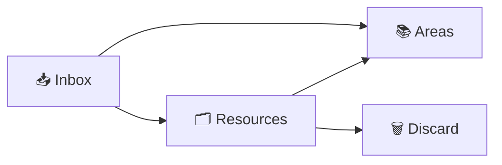
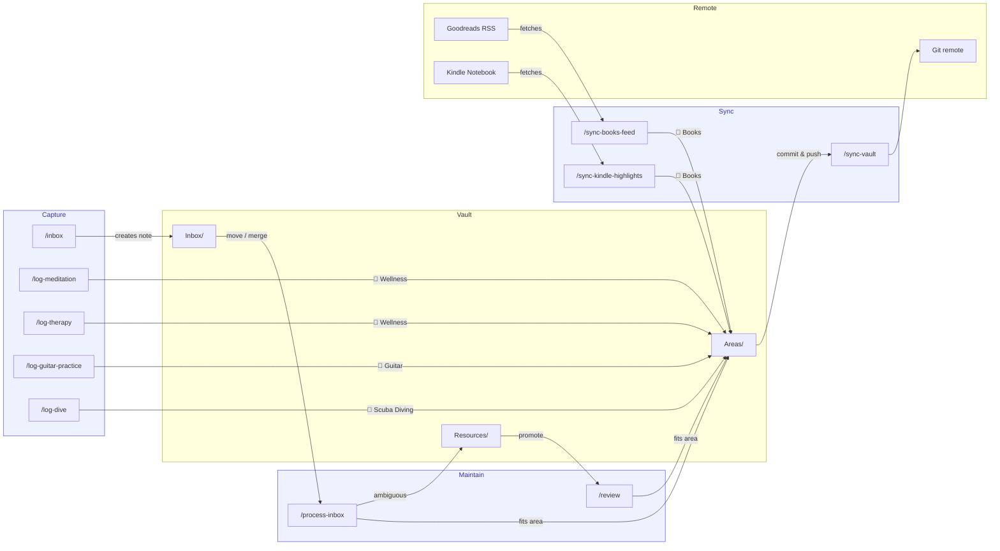

#### Table of Contents

- [The problem with silos](#the-problem-with-silos)
- [Architecture: three tiers](#architecture-three-tiers)
- [The workflow](#the-workflow)
- [Privacy by design](#privacy-by-design)
- [Syncing the outside world](#syncing-the-outside-world)
- [Limitations](#limitations)

---

Personal knowledge management is one of those problems that feels solved until
you actually try to retrieve something. I had five places where I kept things I
cared about. Browser bookmarks for parts I was considering for [the keyboard I
was building]() — valid
only as long as the vendor's website stayed up. Notion notes organized into a
tidy hierarchy I stopped opening the moment I transitioned fully to Claude.
Claude Project instructions and artifacts which replaced Notion, and I was even
using them for journaling — but the project instructions and output artifacts
kept growing until it got out of hand after a while. Kindle highlights spread
across every book I'd read, locked inside Amazon's interface, disconnected from
anything I'd thought since. And handwritten diving logbooks — analog by design,
physically unreachable unless I happened to be sitting next to them on the
shelf.

The problem wasn't that I was storing things badly. It was that none of it
talked to each other, and anything outside Claude couldn't be enriched. My
highlights from a psychology book had no link to the concepts I was actively
working through. My diving logs had no connection to my certifications or gear.
My bookmarks were a write-only archive. Each tool was fine in isolation and
completely blind to everything else.

That's an integration problem, not a storage problem. Standalone Obsidian would
have been the obvious choice, but it couldn't pull in external sources
automatically, had no AI for triage and enrichment, and Obsidian Sync doesn't
offer the encryption guarantees I wanted. So I built
[Mneme](https://en.wikipedia.org/wiki/Mneme) on top of it — a git-crypt
encrypted, AI-assisted vault with automated sync, named after the Greek muse of
memory.

### The problem with silos

Every source I had contained genuinely useful information — it was just
stranded. No connections, no way to pull it together into something coherent.

Beyond the silos, there's entropy. Without a discipline for maintaining notes,
things rot quietly. Bookmarks go stale. That Notion hierarchy I'd built so
carefully became full of outdated context I'd never go back to prune.

And then there's the enrichment problem — the one that bothered me most. Raw
highlights aren't knowledge. A bookmark without context is just a URL. A
handwritten log entry with no cross-links is an isolated observation.
Information only becomes useful when it's connected, contextualized, and
revisited over time. None of my tools did any of that.

### Architecture: three tiers

The vault is organized around a single principle: **information should flow
toward its natural home, not accumulate in inboxes.**

**Inbox** is the frictionless entry point. Any thought, link, highlight, or log
entry that doesn't have an obvious home lands here as a timestamped markdown
file. The rule is: capture first, decide later.

**Areas** are the long-term domains I actively maintain — Books, Finance,
Guitar, Scuba Diving, Wellness, and a few others. Each area has a consistent
structure: a summary note, relevant sub-notes, and a log for time-series data
(practice sessions, dives, therapy sessions). An area exists because it reflects
an ongoing, durable interest — not a one-off curiosity.

**Resources** is the staging ground for everything that doesn't yet have a clear
home. A resource is a note that might eventually graduate to an area, or get
discarded once it's clear the interest was fleeting. The key insight here is
that Resources is not an archive. It's a waiting room with an eviction policy:
when three or more resources on the same topic accumulate, that's a signal that
a new area is warranted. One lonely resource untouched for six months is a
signal to delete it.

This tiered structure forces a decision at every stage. Nothing sits in the
inbox forever. Nothing accumulates in resources without eventually being
promoted or discarded. The vault stays lean.

### The workflow

The system runs on three modes: **capture**, **process**, and **review**.

Capture is deliberately low-friction. When something is worth saving — a
thought, a link, a log entry — it goes into the inbox immediately, without
worrying at the moment of capture about where it belongs.

Processing is where the inbox gets triaged: each note either moves to an
existing area, gets parked in resources if its home isn't clear yet, or gets
discarded if it wasn't worth keeping. This is also where cross-links get added —
connecting a new book note to a related psychology concept, or a gear purchase
to the Guitar area's signal chain.

The judgment calls in this stage aren't mechanical. A note about sleep quality
could belong in Wellness or be a fleeting observation worth discarding. A
half-formed thought about a leadership model might fit Psychology or deserve its
own resource. For this I use Claude skills — short, purpose-built prompts that
review each inbox note in context and decide where it belongs. The goal isn't to
automate the triage so I don't think about it. It's to make the right call
consistently without spending twenty minutes second-guessing every note. Claude
brings semantic judgment; I bring the final say.

Triage isn't the only thing Claude is good for here. Existing notes can be
enriched on demand. I once asked Claude to flesh out the signal path of my
guitar gear — the pedals, the amp, the routing — with technical specifications
pulled from the web. It came back with detailed specs for each piece of gear, I
reviewed and corrected where needed, and the note went from a personal list to
an actual reference. That loop — Claude proposes, I verify — is what keeps the
vault accurate without making enrichment a manual research project.

Review is the maintenance pass: surfacing orphaned notes, flagging stale content
that hasn't been touched in six months, identifying resources that have crossed
the three-note threshold and deserve promotion to a full area. A health check,
not a rewrite session.

The three-mode discipline is what keeps entropy from winning. Most PKM systems
have good capture. Almost none have a real process and review loop. That's where
the rot starts.

### Privacy by design

Mneme lives in a private Git repository, encrypted at rest with
[git-crypt](https://github.com/AGWA/git-crypt). Every markdown file is opaque in
the remote — only someone with the symmetric key can read the contents. The key
lives in my password manager and a secured external drive. This isn't paranoia;
it's just the right default for a vault that contains financial accounts, health
logs, and therapy session notes.

The less obvious privacy consideration is commit messages. Git-crypt encrypts
file contents, not metadata. A commit message like "Add dive: Red Sea with John"
leaks personal details in plaintext, visible to anyone with read access to the
repo. The convention I enforce is structural, never personal: "Add dive log
entry" is fine, "Add dive: Red Sea with John" is not. It's a small discipline
that matters over years of commits.

### Syncing the outside world

The point of building a unified vault is that it should actually unify things.
That means pulling external sources in, not relying on manual transcription.

Two integrations do the heavy lifting. The Goodreads RSS feed syncs my reading
log automatically — books move between shelves (To Read → Currently Reading →
Read) and the vault reflects it without me touching anything. The Kindle
integration goes further: it fetches my highlights directly from Amazon's
reading interface and embeds them into the relevant book notes. There's no
official API for this, so it uses session cookies, but it runs idempotently —
re-running it replaces the highlights section without duplicating anything.

The effect is that when I finish a book, the vault already has my highlights
waiting. I just add context, cross-links, and a rating. The raw data arrives
automatically; the enrichment is mine to add.

This is the inversion that makes the system work. Instead of manually migrating
highlights from Kindle or transcribing a dive from a paper logbook into a
markdown table, the system meets the data where it lives and brings it home. The
handwritten logbooks I still fill out on the boat — that's a ritual I don't want
to give up — but the moment I'm back at my desk, they get a digital entry in the
vault, linked to gear and certifications and past dives.

### Limitations

The obvious one: this only works from my MacBook. The entire workflow runs
through Claude Code skills in the terminal — there's no app, no mobile
interface, no web UI. If something is worth capturing while I'm away from my
desk, I'm relying on memory or a scratchpad until I get back. For a system built
around low-friction capture, that's a real gap. In practice I've made peace with
it — most of my capturing happens at the desk anyway — but it means Mneme is a
complement to mobile note-taking, not a replacement.

The less obvious one: the git-crypt key is a single point of failure. The
encrypted vault is worthless without it. I keep copies in my password manager
and on a secured external drive, but if both are somehow lost, so is every note,
log, and highlight I've stored. That's not hypothetical risk — it's the direct
tradeoff of choosing local encryption over a cloud-managed key. I think it's the
right tradeoff, and that's fine, but it demands taking the backups seriously.
