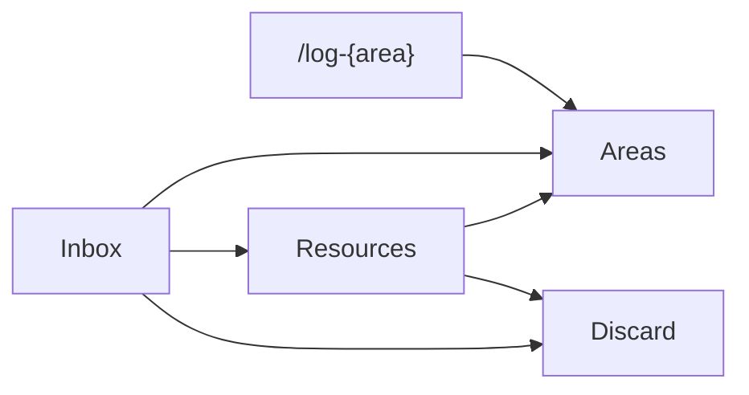
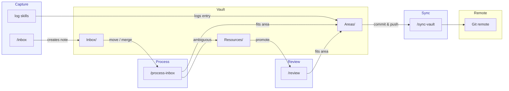

#### Table of Contents

- [How Mneme remembers](#how-mneme-remembers)
- [The workflow](#the-workflow)
- [Privacy by design](#privacy-by-design)
- [Syncing the outside world](#syncing-the-outside-world)
- [Limitations](#limitations)
- [Start your own Mneme](#start-your-own-mneme)

---

I had five places where I kept things I cared about. Browser bookmarks for parts
I was considering for the keyboard I was building, and guitar parts and pedals I
kept referencing — valid only as long as the vendor's websites stayed up. Notion
notes organized into a tidy hierarchy I stopped opening the moment I
transitioned fully to Claude. Claude Project instructions and artifacts which
replaced Notion over time. I was even using Claude artifacts for journaling —
but the project instructions and output kept growing until it got out of hand.
Kindle highlights spread across every book I'd read, locked inside Amazon's
interface, disconnected from anything I'd thought since. And handwritten diving
logbooks — analog by design, physically unreachable unless I happened to be
sitting next to them on the shelf.

This is what personal knowledge management (PKM) actually looks like in
practice. My highlights from a psychology book had no link to the concepts I was
actively working through. My diving logs had no connection to my certifications
or gear. My bookmarks were a write-only archive. Each tool was fine in isolation
and completely blind to everything else.

That's an integration problem, not a storage problem. Standalone Obsidian would
have been the obvious choice, but it couldn't pull in external sources
automatically, had no AI for triage and enrichment, and most importantly,
Obsidian Sync doesn't offer the encryption guarantees I wanted. So I built
[Mneme](https://github.com/le4ker/mneme-template) on top of it — an end-to-end
encrypted, AI-assisted vault with automated sync, named after the Greek muse of
memory.

## How Mneme remembers

The vault is organized around a single principle: **information should flow
toward its natural home, not accumulate in inboxes.**

**Inbox** is the frictionless entry point. Any thought, link, highlight, or log
entry that doesn't have an obvious home lands here as a timestamped markdown
file. The rule is: capture first, decide later.

**Areas** are the long-term domains I actively maintain — Books, Finance,
Guitar, Scuba Diving, Wellness, and a few others. Each area has a consistent
structure: a summary note, relevant sub-notes, and a log for time-series data.
An area exists because it reflects an ongoing, durable interest — not a one-off
curiosity.

Some entries skip the inbox entirely. The journaling flows — Claude Code skills
like `/log-dive`, `/log-guitar-practice`, `/log-meditation`, `/log-therapy` —
write directly to the relevant area's log. Structured enough that there's
nothing to triage.

**Resources** is the staging ground for everything that doesn't yet have a clear
home. A resource is a note that might eventually graduate to an area, or get
discarded once it's clear the interest was fleeting. The key insight here is
that Resources is not an archive. It's a waiting room with an eviction policy:
when three or more resources on the same topic accumulate, that's a signal that
a new area is warranted. One lonely resource untouched for six months is a
signal to delete it.

## The workflow

The system runs on three modes: **Capture**, **Process**, and **Review**:

Capture is deliberately low-friction. When something is worth saving — a
thought, a link, a log entry — it goes into the inbox immediately, without
worrying at the moment of capture about where it belongs.

Processing is where the inbox gets triaged: each note either moves to an
existing area, gets parked in resources if its home isn't clear yet, or gets
discarded if it wasn't worth keeping. This is also where cross-links get added —
connecting a new book note to a related psychology concept, or a gear purchase
to the Guitar area's signal chain.

The judgment calls in this stage aren't mechanical. A note about sleep quality
could belong in Wellness or be a fleeting observation worth discarding. A
half-formed thought about a leadership model might fit Psychology or deserve its
own resource. For this I use Claude skills — short, purpose-built prompts that
review each inbox note in context and decide where it belongs. The goal isn't to
automate the triage so I don't think about it. It's to make the right call
consistently without spending twenty minutes second-guessing every note. Claude
brings semantic judgment; I bring the final say.

Triage isn't the only thing Claude is good for here. Existing notes can be
enriched on demand. I once asked Claude to flesh out the signal path of my
guitar gear — the pedals, the amp, the routing — with technical specifications
pulled from the web. It came back with detailed specs for each piece of gear, I
reviewed and corrected where needed, and the note went from a personal list to
an actual reference. That loop — Claude proposes, I verify — is what keeps the
vault accurate without making enrichment a manual research project.

Review is the maintenance pass: surfacing orphaned notes, flagging stale content
that hasn't been touched in six months, identifying resources that have crossed
the three-note threshold and deserve promotion to a full area. A health check,
not a rewrite session.

The three-mode discipline is what keeps entropy from winning. Most PKM systems
have good capture. Almost none have a real process and review loop. That's where
the rot starts.

## Privacy by design

Mneme lives in a private Git repository, encrypted at rest with
[git-crypt](https://github.com/AGWA/git-crypt). Every markdown file is opaque in
the remote — only someone with the symmetric key can read the contents. The key
lives in my password manager and a secured external drive. This isn't paranoia;
it's just the right default for a vault that contains financial accounts, health
logs, and therapy session notes.

The less obvious privacy consideration is commit messages. Git-crypt encrypts
file contents, not metadata. A commit message like "Add dive: Red Sea with John"
leaks personal details in plaintext, visible to anyone who gains read access to
the repo — today or later. The convention I enforce is structural, never
personal: "Add dive log entry" is fine, "Add dive: Red Sea with John" is not.
It's a small discipline that matters over years of commits.

## Syncing the outside world

The template's core sync step just commits and pushes. But the architecture is
easy to extend — you can add skills that pull external data into the vault
before the commit. Manually copying in highlights and reading logs defeats the
point, so I added two integrations to my own setup. The Goodreads RSS feed syncs
my reading log automatically — books move between shelves (To Read → Currently
Reading → Read) and the vault reflects it without me touching anything. The
Kindle integration goes further: it fetches my highlights directly from Amazon's
reading interface and embeds them into the relevant book notes. There's no
official API for this, so it uses session cookies. It runs idempotently though —
re-running it replaces the highlights section without duplicating anything.

The effect is that when I finish a book, the vault already has my highlights
waiting. I just add context, cross-links, and a rating. The raw data arrives
automatically; the enrichment is mine to add.

This is the inversion that makes the system work. Instead of manually migrating
highlights from Kindle or transcribing a dive from a paper logbook into a
markdown table, the system meets the data where it lives and brings it home. The
handwritten logbooks I still fill out on the boat — that's a ritual I don't want
to give up — but the moment I'm back at my desk, they get a digital entry in the
vault.

## Limitations

Mneme doesn't run on mobile devices. The entire workflow runs through Claude
Code skills in the terminal — there's no app, no mobile interface, no web UI. I
interface with it from my [Neovim
setup]() and it can also be interfaced
straight with Claude Code. If something is worth capturing while I'm away from
my desk, I'm relying on a Claude chat on my phone until I get back.

The end to end encryption of Mneme is a single point of failure. The encrypted
vault is worthless without it. I keep copies in my password manager and on a
secured external drive, but if both are somehow lost, so is every note, log, and
highlight I've stored. That's not hypothetical risk — it's the direct tradeoff
of choosing local encryption over a cloud-managed key. I think it's the right
tradeoff, and that's fine, but it demands taking the backups seriously.

## Start your own Mneme

If you want to build something similar, Mneme is published as a
[GitHub template repository](https://github.com/le4ker/mneme-template). Fork it,
run the `/setup` skill, and Claude will ask which areas you want to track and
generate the vault structure and skills for you. Feel free to strip out the
parts that don't fit and make it yours.

I'd love to hear how others are using Claude skills outside of work — this felt
like an unusual use case when I started it, but it's become the part of my setup
I touch most.
